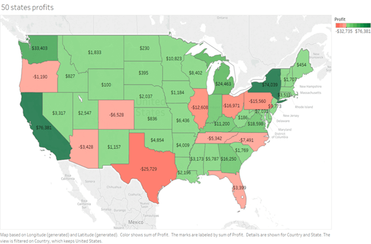

## Vizualizace dat

### 1. Co je vizualizace dat?
- Grafická reprezentace dat
- Slouží pro lepší porozumění dat
- Důležité pro komunikaci

### 2. Principy vizualizace
- Vizualizace by měla být jednoduchá aby se dobře četla
- Při  vybírání barev u vizualizace je třeba dbát na lidskou psychologii (zelená značí dobré, červená špatné)
- Nejdůležitější u vizualizace dat je správné vybrání správného typu vizualizace (bar char, pie chart, scatter plot, atd...)
- Pro lepší porozumění je dobré využívat popisky (popsat co je na jednotlivých osách a přidání legendy)

### 3. Jak se zneužívá vizualizace pro manipulaci
- #### **a. Posunutí spodní hranice:**
    - Využívá se hlavně u bar chartů
    - Při posunutí spodní hranice se vytváří vizuálně větší rozdíl mezi "bary" (viz. obr. 1. a 2.)

    
    (obr. 1., hranice je posunutá z 0% na 58%)

    
    (obr. 2., pokud se hranice vrátí zpátky na 0% je vidět, že rozdíl není tak velký)
- #### **b. Prodloužení osy y**
    - Při prodloužení osy y se vytváří opak posunutí spodní hranice, rozdíl se vizuálně zmenšuje (viz. obr. 3. a 4.)

    
    (obr. 3., kvůli prodloužené ose y není vidět velký rozdíl mezi začátkem a koncem plotu)

    
    (obr. 4., u stejných dat je lépe vidět rozdíl mezi rokem 1880 a 2014, také můžeme lépe pozorovat trendy)

- #### **c. Cherry picking**

    - cherry picking je typ manipulace, ve kterém si vybereme pouze část dat, která pomáhá našemu argumentu (viz. obr. 5. a 6.)

    
    (obr. 5., kvůli vybrání úseku od roku 1997 do 2012 data ukazují, že se globální oteplování vyrovnalo, tudíž neexistuje)

    
    (obr. 6., pokud se podíváme na celá data zjistíme, že teplota se zvedá, úsek z obr. 5. je vyznačen šedě)

- #### **d. Volba špatných barev**
    - Pokud vybereme barvy obráceně než mají být, můžeme vyvolat opačný dojem z vizualizace (viz. obr. 7. a 8.)

    
    (obr. 7., vypadá to, že jsou spojené státy v deficitu, ale pokud se podíváme na legendu zjistíme, že zelená zde znamená deficit a červená profit)

    
    (obr. 8., takto by vizualizace byla správně, profit je zelený a deficit je červený)

### 4. Příklady použití vizualizace

#### Requirements:
1. Python
2. knihovny: `pandas`, `matplotlib`, `seaborn`, `plotly`
3. data set v csv formátu
#### Import knihoven a datasetu

```
import pandas as pd
import matplotlib.pylot as plt
import seaborn as sns
impport plotly.express as px

df = pd.read_csv("[cesta k datasetu]")
```

 #### **a. Pie charty** 
 - Pie chart reprezentuje rozložení celku na části
 - Ideální je ho používat pro zobrazení max. čtyř složek
 - Pokud mají data více než čtyři složky pie chart je nepřehledný a těžko se rozeznávají rozdíly v datech
 - Pro lepší přehlednost můžeme do pie chartu přidat zobrazení procent
 - pie chart vytvoříme pomocí knihovny matplotlib:  

  ```
    lables = ['nějaké', 'popisky´]
    colors = ['nějaké', 'barvy']

    plt.pie(df['Název sloupce v datasetu'], labels=labels, colors=colors)
  ```
  #### **b. Bar charty**
  - Využívá se pro porovnání hodnot jiných kategoriích
  - bar chart vytvoříme pomocí matplotlib:
  ```
  colors = ['nějaké', 'barvy']

  plt.bar(df['první kategorie'], df['druhá kategorie'], colors=colors)

  plt.xlabel('název x osy')
  plt.ylabel('název y osy')
  ```
#### **c. Histogramy**
- distribuce hodnot
- histogram vytvoříme pomocí matplotlib:
```
plt.hist(df['první kategorie'], color='nějaká barva', alpha=[0-1], label='popisek')
plt.hist(df['druhá kategorie'], color='nějaká barva', alpha=[0-1], label='popisek')

plt.legend()
plt.xlabel('název x osy')
plt.ylabel('název y osy')
```
#### **d. Boxploty**
- Shrnuje distribuci dat
- Ukazuje median
- boxplot vytvoříme pomocí matplotlib:
```
lables = ['nějaké', 'popisky´]
plt.boxplot(df['první kategorie'], df['druhá kategorie'], labels=labels)
plt.xlabel('název x osy')
plt.ylabel('název y osy')
```
#### **e. Swarmploty**
- Zobrazuje rozložení bodů dat v různých kategoriích
- Swarmplot vytvoříme pomocí knihovny seaborn:
```
sns.swarmplot(data=df, x='první kategorie', y='druhá kategorie')

plt.xlabel('název x osy')
plt.ylabel('název y osy')
```
#### **f. Scatterploty**
- Vztah mezi dvěma spojitými hodnotami
- Vytvoříme pomocí knihovny plotly:
```
px.line().add_scatter(x = df['první kategorie'], y = df['druhá kategorie'], name='název scatterplotu')
```
